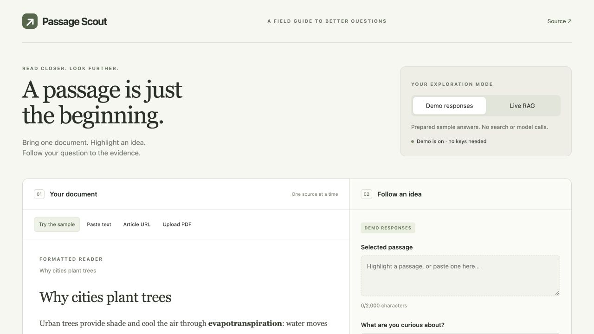

# Passage Scout

**Read closer. Look further.** A local-first portfolio app for learning Python, web-backed retrieval-augmented generation (RAG), and OpenTelemetry.

Read one text document, article, or selectable-text PDF. Select a passage, ask a question, and follow numbered citations to web evidence. A React/TypeScript reader sits alongside a FastAPI backend with explicit search, extraction, ranking, and generation stages.



## Run locally

Requires Python 3.11–3.13 and Node 20+. No provider accounts or keys are needed for Demo.

```sh
git clone https://github.com/flyoungiv/passage-scout.git
cd passage-scout
python3 -m venv .venv
source .venv/bin/activate
pip install -r requirements-dev.lock
pip install --no-deps -e .
npm ci --prefix frontend
npm run build --prefix frontend
uvicorn passage_scout.main:app --host 127.0.0.1 --port 8000 --no-proxy-headers
```

Open http://127.0.0.1:8000. Use one worker: accounting and concurrency limits are intentionally process-local. Run from the repository root so `.env` is found. For frontend development, run `npm run dev --prefix frontend` in a second terminal; Vite proxies `/api` to port 8000.

## Demo versus Live RAG

| Mode | What happens | External calls |
|---|---|---|
| Prepared sample + prepared question | A labeled, bundled answer and evidence paraphrase | None |
| Any other Demo question/document | Explicitly illustrative response, no grounding claim | None |
| Live RAG | Tavily search → Tavily extraction → Python lexical ranking → Groq generation → citation validation | Tavily and Groq |

Fetching an article URL contacts that article's host even in Demo; answering in Demo does not. PDF parsing happens locally. Only the question and selected passage go to providers, not the entire document. Without a selection, Live searches the question alone. Documents and answers live in the browser's memory; the API does not save them. Reloading clears them.

The original PDF view uses the browser's viewer, with a separate question box. It does not capture highlights. Scanned, encrypted, and oversized PDFs are unsupported; the original view remains available for valid PDFs whose text extraction fails.

## Enable live providers

```sh
cp .env.example .env
# Edit .env locally: TAVILY_API_KEY and GROQ_API_KEY
```

Restart the server, switch to **Live RAG**, and ask a question. Never paste keys into the frontend, a GitHub issue, or chat. Keys are loaded on the server. A live failure displays an error and offers Demo; it never substitutes a canned answer.

Default model: `openai/gpt-oss-20b`. The [Tavily credits documentation](https://docs.tavily.com/documentation/api-credits) and [Groq limits documentation](https://console.groq.com/docs/rate-limits) were checked during implementation. Example defaults: Tavily 1,000 credits/month, basic search 1 credit and basic extraction 1 credit per 5 successful URLs; Groq 30 requests/minute, 1,000/day, 8,000 tokens/minute and 200,000/day. These are configurable examples, **not guarantees**. Your account dashboard is authoritative. Do not enable paid plans or automatic paid overages for this project.

The Usage panel distinguishes conservative app reservations from provider-reported tokens and last-response headers. Tavily reserves 2 credits per attempted request, including failures; Groq reserves 7,000 tokens, then settles to reported usage when available. Failed/ambiguous requests retain their reservation. Counts reset on restart and do not include usage by other apps. UTC clock windows are not exact replicas of provider rolling windows.

## Verification

```sh
source .venv/bin/activate
ruff check backend tests scripts
ruff format --check backend tests scripts
pytest -q
python scripts/evaluate.py
python scripts/telemetry_smoke.py
npm run build --prefix frontend
cd frontend
npx playwright install chromium
npm test
```

The prepared [CI workflow](docs/ci-workflow.yml) runs Python tests, static checks, fixed retrieval evaluation, a production frontend build, and Chromium browser tests. Publishing it to `.github/workflows/ci.yml` is pending GitHub workflow permission. Provider tests use contract fixtures and do not prove real account access. After adding local keys, run `python scripts/live_smoke.py` from the repository root for an actual provider request (consumes credits/tokens). It prints only mode, citation count, and provider status, not the question or response text.

## Learn the design

- [Architecture and tradeoffs](docs/architecture.md)
- [Ten-minute demo and interview walkthrough](docs/walkthrough.md)
- [OpenTelemetry, local Grafana, and dashboard](docs/observability.md)
- [Verification record and limitations](docs/verification.md)
- [Provider API references](docs/providers.md)

## Safety and scope

Text is limited to 100,000 characters; PDFs default to 5 MB / 30 pages; articles to 2 MB. Article fetching validates all DNS answers, pins the validated public IP to the connection, validates each redirect, verifies TLS, and has a 20-second subprocess deadline. PDF parsing is isolated with a 12-second deadline, CPU limits, and a Linux address-space cap. No OCR or login-page handling. Markdown is rendered through an element allowlist with raw HTML disabled; documents cannot load remote images or execute scripts.

The app is designed for a single local user. Remote paid-provider calls, article fetches, and PDF parsing are denied unless `LIVE_ACCESS_TOKEN` is configured. A configured token is required for local calls too. Use HTTPS, configure `ALLOWED_HOSTS`, and keep proxy-header trust disabled unless explicitly secured. A public production service also needs a durable shared quota store, gateway rate limiting, and operational monitoring. **No hosted deployment or paid service was enabled.**

Citations prove that an answer references retrieved passages, not that every claim is true. Source quality, prompt injection, lexical retrieval misses, and model hallucinations remain limitations. Inspect evidence and original sources. No accounts, conversation persistence, multi-document retrieval, or vector database are included.
