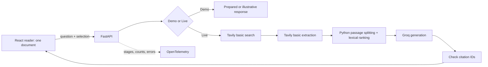

# Architecture decisions

## 1. Separate exploration from paid-provider work

Demo is the default and deterministic. Exact sample text plus a prepared question unlocks a prepared answer. Arbitrary documents cannot accidentally receive apparently grounded canned answers. Live errors remain errors. This makes a portfolio demo useful without provider credentials and keeps evaluation honest.

## 2. Keep the pipeline visible in Python

`providers.py` orchestrates independent stages; `retrieval.py` chunks source text, scores query-term overlap using term frequency and inverse document frequency, length-normalizes scores, and chooses up to five passages with at most two per URL. A vector database would add infrastructure without much benefit for five fresh web results. The cost is weaker synonym and semantic recall. Fixed retrieval cases make regressions visible, but are not a broad quality benchmark.

Search snippets are not passed straight to generation. Extraction is a distinct API call, ranking is explicit, and only extracted passages enter the prompt. The selection is query context, not evidence. URLs must have appeared in search results before extracted content is admitted. The model receives numbered evidence rather than invented citation URLs. Citation validation rejects unknown IDs and answers without citations; it does not establish semantic entailment.

## 3. Bound context and consumption

Five search results, 40,000 characters per extracted source, 1,200-character chunks with overlap, and five final passages bound ranking. Before generation, selection and evidence are shortened until the UTF-8 message content fits 5,400 bytes, leaving room in a conservative 7,000-token reservation for message overhead and 1,200 output tokens. The UI displays the exact evidence excerpts supplied to generation. Byte budgeting is intentionally conservative for byte-level tokenizers; a different model may require a tokenizer-aware budget.

Only one live request and one input-processing job run at a time. Usage reserves capacity under a lock before any provider work. Counts and limits are process-local; this is why the documented server uses one worker. A reservation is a local estimate, not a provider balance. A restart clears counters. Distributed deployment requires a shared store and admission control outside this process.

## 4. One active document, no persistence

The browser owns document text and the PDF blob URL; the API processes input and returns text. Loading a new source clears selection and answers. No files or conversations are retained. Markdown supports headings, emphasis, and lists while an allowlist prevents remote media and raw HTML. PDF extraction is approximate: original layout, columns, and headings may be lost. The original viewer is the fallback, not a second highlighting engine.

## 5. Observe behavior without capturing content

Explicit spans measure stages and return a trace ID. Structured logs include only stage, duration, outcome, trace ID, and span ID. Metrics contain bounded labels. Provider exceptions and bodies are not recorded. No automatic HTTP instrumentation captures URLs, request payloads, or authorization headers. Configure OTLP to export traces, metrics, and the sanitized logger; otherwise nothing is sent externally.

## 6. Local trust and input boundaries

URL fetching rejects private, reserved, loopback, link-local and mixed public/private DNS answers; the connected socket uses the resolved public IP while TLS verifies the original hostname. Redirects are revalidated. Proxies and cookies are not used. Worker subprocesses bound DNS, slow reads, decompression, and parsing wall time. PDF CPU and Linux memory limits reduce exposure; macOS does not support the same address-space limit. This is defense in depth, not a hostile multi-tenant sandbox.

Trusted hosts and same-origin checks mitigate browser attacks against localhost. Public callers require a configured access token. Tokens stay in tab memory and must be sent only over HTTPS outside localhost. This is small-project access control, not an account system.
